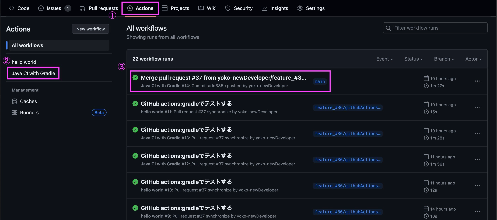

# GitHub Actionとは

ワークフローを自動化する
自動でビルド->テスト->デプロイまで管理できる様になる仕組み

- CI（継続的インテグレーション）：ビルド＆テスト
- CD（継続的デリバリー）：デプロイ

## ワークフロー構文

- `name:`(省略可能)ワークフロー名。GitリポジトリのActionタブに表示される
- `on:`アクションのトリガー
    - `push`や`pull_request`でトリガーのタイミングを指定可能
    - `pull_request`:デフォルトで`types: [ opened, synchronize, reopened ] 3つのイベントが実行される By default
        - `opened`: Pull Requestがopenされたときにワークフローが動き出す
        - `synchronize`: Pull Requestに対して何らかの変更(=push)があったときにワークフローが動き出す
        - `reopen`:Pull Requestが再度openされたにワークフローが動く
- `branches`ブランチを指定可能
- `permissions:`アクション実行時のリポジトリコンテンツに対する権限
- `jabs:`ワークフローファイルで実行されるすべてのジョブをグループ化している
    - `build:`ジョブの名前。実行環境と手順を定義
    - `runs-on:`ジョブを実行するマシンの種類を設定(`ubuntu-latest`:最新のUbuntu環境)
    - `steps:`具体的なタスク(手順)
    - `uses:`ジョブで指定するリポジトリ
- `run:`具体的なシェルで | を使えばパイプライン処理も可能
- `run-name:`pushやpull_requestイベントによってトリガーされるワークフローの場合、コミットメッセージとして設定される

## タスク順序

- Hello worldするだけのワークフローを作成
- Pull Request をトリガーにして動くようワークフローを修正
- Gradle で test する方法を調べる
- GitHub Actions で Gradle で test する方法を調べてワークフローに修正
- GitHub Actionsでファイルをzipに固めてアップロードする方法を検索
- /gradlew test の実行結果のテストレポートをUploadするようにワークフローを修正

## gradleでtestする方法

- GradleでJavaのプロジェクトのビルドとテストを行う
- docker compose upする手順をワークフロー内に組み入れること

## 動作確認

- `./gradlew test`:Gradleを使ってプロジェクトをビルドし、ユニットテストを実行する
- `./gradlew clean test`:プロジェクトをクリーンにしてからテストする

##            

- `uses: actions/upload-artifact@v2`:`upload-artifact`を使用してアップロードを行う
- アップロード先：GitHubのストレージ

## artifact確認方法

- `Actions`一覧より左のサイドバーから該当のワークフローを選択->`workflow runs`から実行の名前を選択
  

- `Artifacts`：成果物が生成されている
  

- zipを確認
  

## cacheクリア

- ワークフロー内で時間がかかっているログを確認
  

- Actions->Cteate Archive->所要時間が長いlogを選択->
  どの段階で時間がかかっているか確認
  

### .github/workflows/gradle.yml

jobs:/build/stepsに追記

- `uses:` キャッシュを操作するためのアクション
- `with:` アクションの設定を記述
    - `path:` Gradleのキャッシュが保存されている場所
    - `key:` キャッシュを特定するキーで、ワイルドカードによってビルドファイルや設定ファイルが変更された場合、keyの一部としてハッシュ化する->
      ファイルが変更されるたびに新しいユニークなキーが生成されてcatchが行われる
